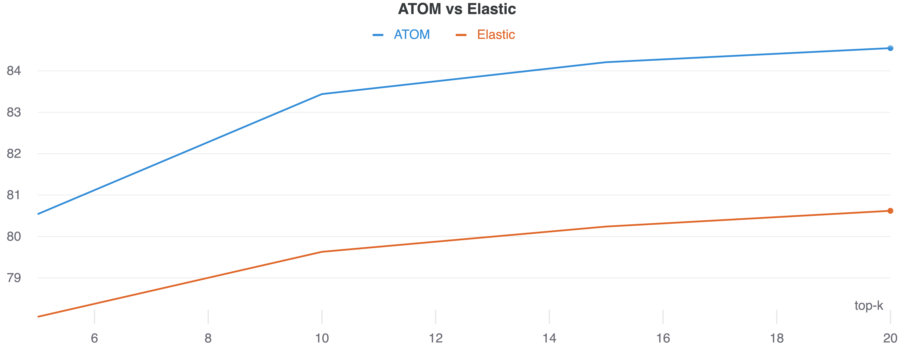
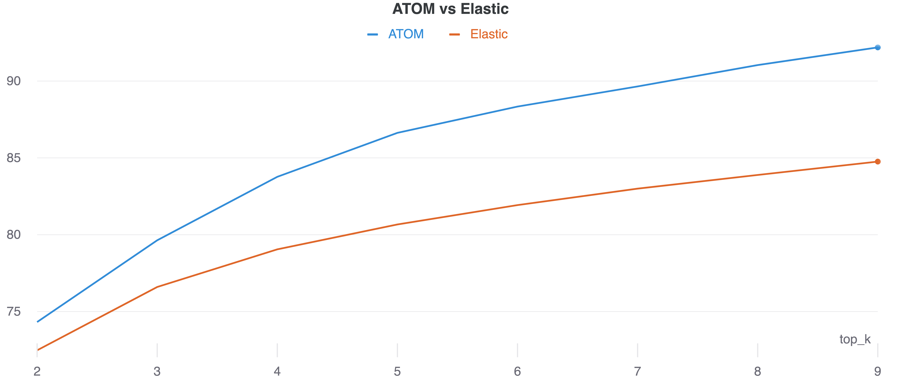

    

Information retrieval - <a href="https://en.wikipedia.org/wiki/Information_retrieval">IR</a> is one of the most "in-demand" subtask. In many search systems the `IR` part is implemented as a separate component `R` that narrows down the search form billions to, let's say, `k=5` candidates. 

The `good-old-fashioned` solution is to use famous <a href="https://en.wikipedia.org/wiki/Elasticsearch">Elasticsearch</a> which is fast and perfomant but lacks the `smart` understanding of what you've told it to search for.

---
They say a good example is worth 2077 pages of API documentation, a million directives, or a thousand words.

Well "they" probably lie... but here's an example query based on <a href="https://en.wikipedia.org/wiki/Fahrenheit_451">Fahrenheit 451</a> book anyway:

> In Fahrenheit 451, what exactly did woman told to the firemen before she light the match and commited a suicide?

> Что сказала женщина пожарникам, решив покончить жизнь самоубийством в произведении Р.Брэдбери «451 градус по Фаренгейту»?

In order to find the correct passage containing the answer you have to understand the contextual meaning. That's something elastic can't do. Hence we present our own solution based on the novel <a href="https://arxiv.org/abs/1810.04805">BERT</a> architecture with multilingual support!

---

> Given the `k` and the collection of question-answer pairs `C`, «how good the retrieval system is» could be defined mathematically as 

Here `R` (aka «Retriever») is just a function that returns the "small" subset of documents (e.g. `k=5`)

---
#### Comparison on dataset «RQ» - aka Russian Questions (by `PJSC Sberbank`)

---

#### Comparison on dataset «NQ» - aka Natural Questions (by `Google LLC`)

---

#### Comparison on dataset «CQ» - aka Custom Questions (by `Igor Tarlinskiy` and `Alexey Schekalkov` and `Korzh Daniil` and `Semen Tarlinskiy`)

---

Please note that this repository is not Open Source or Free. All rights are reserved and You cannot modify or redistribute this code without explicit permission from the copyright holder.

P.S. Contact us at `justanatom@protonmail.com` and we will build the unique and amazing `AI` solution for you.

